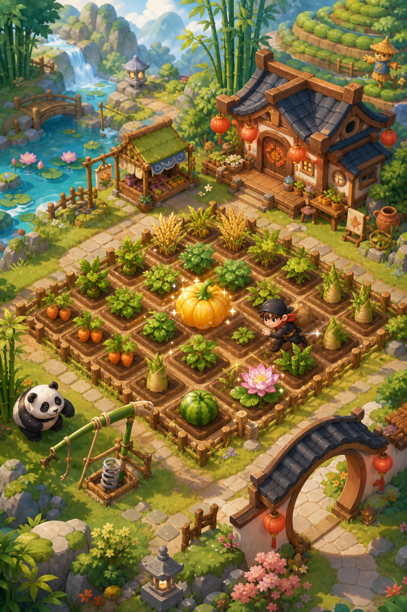
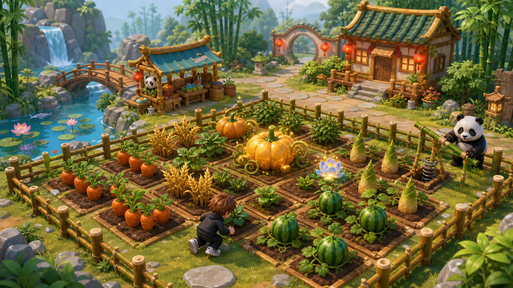

# Lucky Harvest: Farm Thieves

Roblox 中国风 3D 社交农场项目开发文档 v0.1

目标：把经典 QQ 农场的核心上瘾结构转成 Roblox 3D 体验，面向欧美 Roblox 玩家，同时支持繁体中文玩家。

定位：东方幻想农场 + 偷菜 + 陷阱防守 + 复仇 + 轻养成 + 强反馈。

原则：机制借鉴经典农场，资产、UI、名称、视觉表达必须原创，避免复刻 QQ 农场界面、图标、角色或具体美术。

---

## 1. 项目目标

### 1.1 商业目标

第一阶段目标不是做大而全的农场游戏，而是验证以下问题：

- 玩家是否愿意连续玩 10 分钟以上。
- 玩家是否理解种植、收获、偷菜、复仇循环。
- 玩家是否愿意购买加速、保护、幸运肥料、额外地块。
- 偷菜机制是否能制造短视频传播点。
- 中国风视觉是否能在 Roblox 同类游戏里形成记忆点。

### 1.2 目标

项目拆分必须覆盖完整链路：

- Roblox Studio 场景搭建
- Lua / Luau 编程
- 服务端架构
- 客户端 UI
- DataStore 数据保存
- MarketplaceService 付费接入
- 本地化
- 3D 建模
- 简单动画
- 音效接入
- 游戏数值
- 发布和运营

这个项目适合作为长期作品集，但第一版必须小。

---

## 2. 视觉方向

### 2.1 风格目标

美术方向：Rounded Stylized 3D。

中文描述：圆润、软萌、低模但不方块、东方幻想、手游级干净质感。

不要做：

- Minecraft 式方块植物
- Pet Simulator 式盒子宠物
- 高饱和荧光塑料
- 杂乱 Marketplace 资产拼接
- 过度写实
- 直接模仿 QQ 农场 UI 和图标

要做：

- 圆润作物
- 大轮廓植物
- 哑光材质
- 手绘渐变贴图
- 竹林、月门、灯笼、莲花池、茶田
- 可爱但不廉价的熊猫、月兔、小龙灵等宠物

### 2.2 视觉参考图

2.5D 氛围参考：



Roblox 3D 实装目标参考：



### 2.3 Roblox 实装后的现实预期

最终游戏内不会完全达到概念图的细节密度。Roblox 需要兼顾手机端性能，所以实装时要简化：

- 减少远景装饰。
- 植被不要过密。
- 作物模型保持低面数。
- 粒子只用于成熟、稀有、偷菜成功、陷阱触发。
- 场景中重复模型使用统一组件。

目标不是追求影视级画面，而是让玩家感觉：

> 这是一个比普通 Roblox 农场更精致、更统一、更可爱的 3D 农场。

---

## 3. 游戏一句话

玩家经营自己的东方幻想农场，种植稀有作物，拜访别人农场偷成熟作物，布置陷阱保护自己的菜地，被偷后可以复仇。

英文标题建议：

Lucky Harvest: Farm Thieves

繁体中文标题：

幸運農場：偷菜大作戰

---

## 4. 目标玩家

### 4.1 主要玩家

- 美国、加拿大、英国、欧洲 Roblox 玩家
- 年龄大致 8-16 岁
- 喜欢模拟器、tycoon、宠物、收集、轻社交、装饰的玩家

### 4.2 次要玩家

- 台湾、香港、澳门玩家
- 海外华人玩家
- 对 QQ 农场/偷菜机制有情怀的玩家

### 4.3 语言策略

第一版支持：

- English
- Traditional Chinese

默认源语言：English。

不要中英混排。所有 UI 文本使用本地化 key。

---

## 5. 核心循环

### 5.1 基础循环

1. 买种子
2. 种下作物
3. 等待成长
4. 收获作物
5. 出售获得金币
6. 升级地块、工具、背包
7. 解锁更稀有种子

### 5.2 社交循环

1. 访问随机玩家农场
2. 寻找成熟作物
3. 潜入并偷取
4. 避开陷阱
5. 成功逃离获得奖励
6. 农场主收到通知
7. 农场主可以复仇

### 5.3 防守循环

1. 购买防守道具
2. 放置在农场
3. 小偷触发陷阱
4. 农场主获得提示或奖励
5. 升级陷阱

### 5.4 付费循环

付费不阻断免费玩家，只提供速度、便利、保护和炫耀。

- 加速成长
- 提高稀有概率
- 扩展地块
- 临时保护
- VIP 每日奖励
- 陷阱礼包

---

## 6. MVP 范围

第一版只做可验证核心玩法，不做完整大型农场。

### 6.1 必做功能

- 玩家个人 Plot
- 6x6 农田格子
- 10 种作物
- 每种作物 3 个成长阶段
- 种植、成长、成熟、收获
- 基础金币系统
- 种子商店
- 访问随机玩家农场
- 偷成熟作物
- 被偷通知
- 复仇传送
- 3 种陷阱
- 每日奖励
- 简单排行榜
- 英文 + 繁中本地化
- 基础音效
- 2 个 Game Pass
- 3 个 Developer Products

### 6.2 第一版不做

- 玩家自由交易
- 复杂宠物繁殖
- 大型开放世界
- 公会
- PVP 战斗
- 复杂剧情任务
- 多层建筑系统
- 过多作物和宠物

---

## 7. 作物系统

### 7.1 作物数据字段

每种作物需要配置：

- id
- 英文名
- 繁中名
- 稀有度
- 种子价格
- 成长时间
- 基础售价
- 可偷比例
- 解锁等级
- 模型路径
- 图标 asset id

### 7.2 MVP 作物表

| ID | English | 繁中 | 稀有度 | 成长时间 | 种子价格 | 售价 | 解锁 |
|---|---|---|---|---:|---:|---:|---:|
| carrot | Carrot | 胡蘿蔔 | Common | 30s | 10 | 18 | 1 |
| rice | Rice | 稻米 | Common | 60s | 25 | 45 | 2 |
| tea | Tea Leaves | 茶葉 | Common | 90s | 40 | 75 | 3 |
| peach | Peach | 桃子 | Uncommon | 120s | 80 | 150 | 5 |
| pumpkin | Pumpkin | 南瓜 | Uncommon | 180s | 120 | 240 | 7 |
| bamboo | Bamboo Shoot | 竹筍 | Uncommon | 240s | 180 | 370 | 9 |
| watermelon | Watermelon | 西瓜 | Rare | 360s | 300 | 680 | 12 |
| dragonfruit | Dragon Fruit | 龍果 | Rare | 480s | 480 | 1150 | 15 |
| moonlotus | Moon Lotus | 月光蓮 | Epic | 600s | 800 | 2100 | 20 |
| goldenpumpkin | Golden Pumpkin | 金南瓜 | Epic | 900s | 1200 | 3500 | 25 |

### 7.3 成长阶段

每种作物至少 3 个模型：

- Stage 1: Seedling
- Stage 2: Growing
- Stage 3: Mature

成熟阶段要求：

- 体积明显更大
- 颜色更亮
- 可加轻微发光粒子
- 鼠标或手机点击时高亮

---

## 8. 偷菜系统

### 8.1 核心规则

偷菜必须制造情绪，但不能毁掉被偷玩家的体验。

建议规则：

- 每块成熟作物最多被偷 1 次。
- 被偷后，农场主仍可获得 70% 收益。
- 小偷获得 30% 收益。
- 稀有作物被偷时推送通知。
- 被偷玩家可以点击 Revenge 传送到小偷农场。
- 开启 Shield 时无法被偷，或被偷收益降低。

### 8.2 3D 偷菜流程

PC：

1. 玩家靠近成熟作物
2. 出现 `Hold E to Steal`
3. 按住 E 1.5 秒
4. 触发偷菜动作和音效
5. 成功后必须跑到出口
6. 到出口后结算奖励

Mobile：

1. 玩家靠近成熟作物
2. 出现大号 `Steal` 按钮
3. 长按按钮
4. 成功后跑到出口

### 8.3 反破坏设计

不允许：

- 小偷一次偷光整片地。
- 离线玩家所有作物都被偷空。
- 付费玩家完全免疫所有偷菜，导致社交冲突消失。

推荐：

- 每名小偷每次访问最多偷 3 个作物。
- 同一个农场 10 分钟内不能反复偷。
- 新手前 10 分钟有保护。
- 离线玩家最多损失一小部分可偷收益。

---

## 9. 陷阱系统

### 9.1 MVP 陷阱

| ID | English | 繁中 | 效果 | 冷却 | 获得方式 |
|---|---|---|---|---:|---|
| bamboo_spring | Bamboo Spring | 竹子彈簧 | 小偷被弹飞 | 30s | 金币 |
| gong_alarm | Gong Alarm | 銅鑼警報 | 发出警报并标记小偷 | 45s | 金币 |
| panda_guard | Panda Guard | 熊貓守衛 | 追小偷并减速 | 60s | 稀有/付费礼包 |

### 9.2 陷阱原则

- 陷阱要搞笑，不要惩罚过重。
- 小偷失败也应该觉得好玩。
- 陷阱触发必须有强音效和动画。
- 陷阱不要完全阻止偷菜，只提高难度。

---

## 10. 宠物系统

第一版宠物不是核心，但可以作为中后期留存和付费扩展。

### 10.1 宠物定位

宠物是农场守护灵或助手，不做普通猫狗堆量。

候选宠物：

- Baby Panda
- Moon Rabbit
- Lantern Fox
- Little Dragon Spirit
- Tea Sprite
- Bamboo Baby
- Goldfish Spirit
- Cloud Cat

### 10.2 第一版建议

MVP 只做 1 个熊猫守卫作为陷阱/守卫资产。  
宠物抽取系统放到 v0.2 以后。

原因：宠物系统会显著增加建模、动画、UI 和数值复杂度。

---

## 11. UI 设计

### 11.1 UI 风格

UI 方向：

- 木牌
- 竹简
- 云朵面板
- 红灯笼提醒
- 温暖奶油色底板
- 圆角但不过度
- 大图标
- 明确按钮反馈

不要：

- 直接复刻 QQ 农场 UI
- 复杂中文菜单
- 小字过多
- 按钮过窄
- 英文文本溢出

### 11.2 MVP UI 页面

| 页面 | 用途 |
|---|---|
| HUD | 显示金币、钻石、等级、Shield 状态 |
| Bottom Bar | Storage、Shop、Decor、Friends、Rewards |
| Seed Shop | 购买种子 |
| Crop Popup | 显示作物状态、剩余时间、收获按钮 |
| Steal Prompt | 偷菜交互 |
| Theft Notice | 被偷通知和复仇按钮 |
| Revenge List | 最近偷你的人 |
| Trap Inventory | 陷阱选择、放置、升级 |
| Daily Rewards | 每日奖励 |
| Monetization Shop | Robux 商品、Game Pass |

### 11.3 UI Roblox 层级建议

```text
StarterGui
  MainGui
    HudFrame
      CoinsGroup
      GemsGroup
      LevelGroup
      ShieldGroup
    BottomBar
      StorageButton
      ShopButton
      DecorButton
      FriendsButton
      RewardsButton
    Panels
      SeedShopPanel
      CropPanel
      TrapPanel
      RevengePanel
      DailyRewardPanel
      RobuxShopPanel
    Notifications
      TheftNoticeTemplate
      RewardToastTemplate
    MobileControls
      StealButton
      HarvestButton
```

### 11.4 UI 自适应规则

- 使用 Scale 做主要尺寸。
- Offset 只用于小图标和固定间距。
- 所有按钮必须适配手机触控。
- 英文长度优先，繁中自然能放下。
- 使用 `UIScale` 处理不同分辨率。
- 使用 `UIAspectRatioConstraint` 保护按钮和图标比例。

---

## 12. 本地化

### 12.1 语言

- English: 默认
- Traditional Chinese: 繁中

### 12.2 文本 key 示例

```lua
return {
    en = {
        SHOP = "Shop",
        STORAGE = "Storage",
        PLANT = "Plant",
        HARVEST = "Harvest",
        STEAL = "Steal",
        REVENGE = "Revenge",
        SHIELD_ACTIVE = "Shield Active",
        CROP_STOLEN = "Your {crop} was stolen!",
    },
    zh_tw = {
        SHOP = "商店",
        STORAGE = "倉庫",
        PLANT = "種植",
        HARVEST = "收成",
        STEAL = "偷菜",
        REVENGE = "復仇",
        SHIELD_ACTIVE = "保護中",
        CROP_STOLEN = "你的{crop}被偷了！",
    }
}
```

### 12.3 规则

- 不在代码里硬编码显示文本。
- 所有 UI 文案走 key。
- 作物名、道具名、通知文本全部本地化。
- 后续可扩展西班牙语、葡萄牙语、日语。

---

## 13. 音效

### 13.1 MVP 音效清单

| 音效 | 触发 |
|---|---|
| ui_click | 按钮点击 |
| seed_plant | 种下种子 |
| crop_ready | 作物成熟 |
| harvest_coin | 收获金币 |
| rare_crop | 稀有作物成熟 |
| steal_start | 开始偷菜 |
| steal_success | 偷菜成功 |
| alarm_gong | 铜锣警报 |
| trap_boing | 竹子弹簧触发 |
| panda_alert | 熊猫发现小偷 |
| revenge_portal | 复仇传送 |
| purchase_success | 购买成功 |
| purchase_fail | 购买失败 |

### 13.2 背景音乐

主音乐：

- 轻快 acoustic / folk / cozy pop
- 不要强中国风唢呐或戏曲感
- 可以用轻微竹笛、木琴、拨弦元素
- 循环 60-120 秒
- 音量低，不抢音效

---

## 14. 3D 建模规范

### 14.1 软件

推荐：

- Blender：建模、UV、简单动画
- Roblox Studio：导入、碰撞、材质、场景组装
- Krita / Photoshop / Photopea：贴图绘制
- AI 图像工具：概念图、贴图参考、图标参考

### 14.2 模型规格

作物：

- 幼苗：200-500 tris
- 成长期：500-1000 tris
- 成熟期：800-2000 tris
- 贴图：256x256 或 512x512

小建筑：

- 3000-8000 tris
- 贴图：512x512 或 1024x1024

宠物/守卫：

- 1500-4000 tris
- 贴图：512x512
- 动画：Idle、Walk、Alert

### 14.3 命名规范

```text
Crop_Carrot_Stage01
Crop_Carrot_Stage02
Crop_Carrot_Stage03
Trap_BambooSpring
Trap_GongAlarm
Npc_PandaGuard
Building_SeedShop
Decor_Lantern_A
Fence_Bamboo_A
```

### 14.4 Blender 到 Roblox 流程

1. Blender 建模
2. 应用 Scale 和 Rotation
3. 控制原点位置
4. UV 展开
5. 贴图或使用基础材质
6. 导出 FBX
7. Roblox Studio 导入为 MeshPart
8. 设置 CollisionFidelity
9. 设置 Anchored
10. 放入 ReplicatedStorage 或 Workspace
11. 写入资产配置表

### 14.5 AI 在建模里的正确用法

AI 适合：

- 概念图
- 贴图参考
- UI 图标方向
- 缩略图草稿
- 色彩方案

AI 不适合直接作为最终 3D 资产：

- 拓扑通常不干净
- 面数不可控
- 动画骨骼难用
- Roblox 导入可能不稳定
- 风格容易不统一

正确路线：

AI 出参考，Blender 手工建模，Roblox Studio 实装。

---

## 15. 技术架构

### 15.1 Roblox 服务划分

服务端负责：

- 玩家数据
- 金币结算
- 种植状态
- 作物成长
- 偷菜合法性校验
- 陷阱触发
- 购买处理
- 防作弊

客户端负责：

- UI 显示
- 按钮交互
- 本地提示
- 摄像机
- 粒子和音效触发
- 输入检测

原则：任何奖励、金币、作物状态都不能只在客户端决定。

### 15.2 推荐目录结构

```text
ReplicatedStorage
  Remotes
    PlantCrop
    HarvestCrop
    StartSteal
    FinishSteal
    PlaceTrap
    BuySeed
    ClaimDailyReward
  Shared
    Config
      CropConfig
      TrapConfig
      ProductConfig
      Localization
    Utils
      TimeUtils
      NumberFormat

ServerScriptService
  Services
    DataService
    FarmService
    CropService
    TheftService
    TrapService
    MonetizationService
    DailyRewardService
  Main.server.lua

StarterPlayer
  StarterPlayerScripts
    Client
      UIController
      FarmController
      InputController
      AudioController
      LocalizationController

StarterGui
  MainGui

Workspace
  World
    Lobby
    PlayerPlots
```

### 15.3 数据结构

```lua
local PlayerData = {
    Coins = 0,
    Gems = 0,
    Level = 1,
    XP = 0,
    Language = "en",
    UnlockedCrops = {"carrot"},
    OwnedSeeds = {
        carrot = 5,
    },
    Farm = {
        Tiles = {
            ["1_1"] = {
                CropId = "carrot",
                PlantedAt = 0,
                GrowthBoost = 0,
                Stolen = false,
            }
        }
    },
    Traps = {
        Owned = {},
        Placed = {},
    },
    TheftLog = {},
    DailyReward = {
        LastClaim = 0,
        Streak = 0,
    },
    GamePasses = {},
}
```

### 15.4 防作弊要求

必须服务端校验：

- 玩家是否拥有种子
- 地块是否为空
- 作物是否成熟
- 作物是否已经被偷
- 小偷是否在目标作物附近
- 小偷是否访问次数超限
- 金币奖励是否合理
- 商品购买是否由 Roblox 回调确认

---

## 16. 变现设计

### 16.1 Developer Products

| 商品 | 用途 |
|---|---|
| Small Coin Pack | 小金币包 |
| Lucky Fertilizer | 10 分钟提高稀有变异概率 |
| Garden Shield 30min | 30 分钟降低或免疫被偷 |

### 16.2 Game Pass

| Pass | 效果 |
|---|---|
| 2x Harvest | 收获金币翻倍 |
| Extra Plots | 增加可种植地块 |

### 16.3 后续可加

- VIP Gardener
- Auto Harvest
- Trap Bundle
- Rare Seed Pack
- Monthly Garden Club Subscription

### 16.4 变现原则

- 不卖绝对胜利。
- 不让免费玩家完全卡死。
- 付费买速度、便利、外观、保护。
- 保护不能永久完全关闭偷菜，否则社交核心会消失。

---

## 17. 开发路线

### 17.1 第 1 阶段：核心原型

目标：证明种植循环可玩。

任务：

- 创建 Roblox 项目
- 搭建一个空白 Plot
- 做 6x6 农田格子
- 实现种植、成长、成熟、收获
- 做临时 UI
- 做金币数值
- 保存玩家数据

验收：

- 进入游戏能种胡萝卜
- 30 秒后成熟
- 可以收获金币
- 退出重进后数据还在

### 17.2 第 2 阶段：偷菜原型

目标：证明 3D 偷菜成立。

任务：

- 生成多个玩家 Plot
- 支持访问随机玩家农场
- 成熟作物可被偷
- 小偷获得 30% 奖励
- 农场主收到被偷记录
- 支持复仇传送

验收：

- A 玩家能偷 B 玩家成熟作物
- B 玩家仍能收获剩余收益
- B 玩家能看到 Theft Log

### 17.3 第 3 阶段：陷阱和反馈

目标：让偷菜有趣。

任务：

- 竹子弹簧
- 铜锣警报
- 熊猫守卫
- 偷菜长按交互
- 陷阱触发音效
- 成熟粒子
- 收获金币飞行动画

验收：

- 小偷踩陷阱有明显反馈
- 农场主收到提示
- 小偷失败也能继续玩

### 17.4 第 4 阶段：美术替换

目标：从灰盒变成可发布画面。

任务：

- 建 10 种作物三阶段
- 建基础小屋
- 建竹篱笆
- 建石路
- 建月门
- 建种子商店
- 建莲花池
- 调整灯光和后处理

验收：

- 截图能看出东方幻想农场风格
- 不像普通方块 Roblox 农场

### 17.5 第 5 阶段：UI、本地化和付费

目标：达到 MVP 发布标准。

任务：

- 正式 HUD
- 种子商店
- 被偷通知
- 复仇列表
- 每日奖励
- 英文和繁中切换
- Developer Products
- Game Pass
- 移动端适配

验收：

- 手机端可完整游玩
- 所有文字可切换英文/繁中
- 商品购买回调正确

---

## 18. 个人学习路线

### 18.1 第 1 个月

重点：Roblox 基础和 Lua。

学习：

- Roblox Studio 基础
- Part、Model、MeshPart
- Script、LocalScript、ModuleScript
- RemoteEvent、RemoteFunction
- DataStore 基础
- UI 基础

产出：

- 一个能种植和收获的灰盒农场

### 18.2 第 2 个月

重点：完整玩法系统。

学习：

- 服务端校验
- 多玩家 Plot
- 玩家访问
- 简单防作弊
- MarketplaceService

产出：

- 偷菜、防守、复仇原型

### 18.3 第 3 个月

重点：Blender 和资产管线。

学习：

- Blender 基础建模
- UV
- 简单贴图
- FBX 导出
- Roblox 导入
- 低模优化

产出：

- 第一套原创作物、建筑、陷阱

### 18.4 第 4 个月

重点：发布级体验。

学习：

- UI 动画
- 音效管理
- 本地化
- 手机端适配
- 数据分析
- Roblox 发布流程

产出：

- 可小范围测试的 MVP

---

## 19. 验收标准

### 19.1 玩法验收

- 新玩家 1 分钟内知道怎么种植。
- 3 分钟内完成第一次收获。
- 5 分钟内知道可以偷菜。
- 10 分钟内解锁第二种作物或第一次复仇。

### 19.2 视觉验收

- 远看能区分作物。
- 成熟作物有明显奖励感。
- 宠物和植物不方块、不像素。
- 中国风元素明显但不影响欧美玩家理解。
- 截图可作为 Roblox 商店图基础。

### 19.3 技术验收

- 数据保存稳定。
- 服务端控制金币和奖励。
- 手机端按钮可用。
- 低端设备帧率可接受。
- 付费商品只由 Roblox 回调发奖。

---

## 20. 当前决策

已确定：

- 做中国风 3D 社交农场。
- 机制参考 QQ 农场经典偷菜循环。
- 不直接复刻 QQ 农场 UI 和资产。
- 默认英文，支持繁中。
- 美术风格走圆润 3D，不走方块宠物。
- 你以成为 Roblox 全栈为目标，优先自己掌握全链路。

下一步建议：

1. 建立 Roblox Studio 空项目。
2. 创建 6x6 农田灰盒。
3. 写第一版 CropConfig。
4. 实现种植、成长、收获。
5. 再开始建第一个胡萝卜三阶段模型。

