我下面给你两份：

1. **一份 Mermaid 版图**（你可以直接放进 Obsidian）
    
2. **一份文字解释版**（帮助你真正看懂）
    

---

# 当前项目代码思维导图（Mermaid 版）

> 这一版我按你现在**已经实现的内容**来整理，尽量符合你“新手理解 + 便于复习”的需求。

```mermaid
flowchart TD

A[当前项目代码地图] --> B[Shared/共享层]
A --> C[Server/服务端]
A --> D[Client/客户端]
A --> E[Workspace/场景交互点]
A --> F[StarterGui/UI界面]

B --> B1[Constants/常量]
B1 --> B11[GameConstants/默认玩家数据/资源类型]
B1 --> B12[MapConstants/地图相关变量]
B1 --> B13[RemoteNames/远程事件名]

B --> B2[Config/配置]
B2 --> B21[FactionConfig/阵营配置]
B2 --> B22[DungeonConfig/副本配置]
B2 --> B23[LevelConfig/等级配置]
B2 --> B24[ResourceConfig/资源采集配置]
B2 --> B25[EquipmentConfig/装备属性配置]
B2 --> B26[ShopConfig/商店商品配置]

B --> B3[Utils/工具]
B3 --> B31[TableUtils/表工具/深拷贝]
B3 --> B32[FormatUtils/格式化]
B3 --> B33[InstanceUtils/UIWaitUtils/实例或UI辅助]

C --> C1[Bootstrap/服务启动]
C1 --> C11[ServerBootstrap/统一初始化入口]

C --> C2[Managers/管理器]
C2 --> C21[RemoteManager/创建Remotes/Events/Functions]

C --> C3[Services/基础服务]
C3 --> C31[DataService/玩家数据中心]
C3 --> C32[PlayerService/玩家相关基础逻辑]
C3 --> C33[WorldTeleportService/世界传送基础服务]

C --> C4[Systems/系统逻辑]
C4 --> C41[SelectionSystem/选主公/阵营记录/出生处理]
C4 --> C42[TeleportSystem/传送请求/目标点传送]
C4 --> C43[ResourceSystem/资源采集/距离校验/冷却/发奖励]
C4 --> C44[DungeonSystem/副本占位或基础逻辑]
C4 --> C45[ShopSystem/购买请求/扣金币/加背包]

C31 --> C311[GetPlayerData/取玩家数据]
C31 --> C312[PushPlayerData/推送HUD刷新]
C31 --> C313[AddCurrency/加金币木材石头]
C31 --> C314[SpendCurrency/扣金币]
C31 --> C315[AddInventoryItem/加入背包]

D --> D1[Bootstrap/客户端启动]
D1 --> D11[ClientBootstrap/统一初始化客户端]

D --> D2[UI层]
D2 --> D21[UIManager/打开关闭界面/统一按钮关闭]

D --> D3[Controllers/控制器]
D3 --> D31[LoadingController/加载界面]
D3 --> D32[HUDController/读取玩家数据/刷新HUD]
D3 --> D33[MainMenuController/主界面按钮绑定]
D3 --> D34[SelectionController/选主公界面/发请求]
D3 --> D35[TeleportController/靠近传送点/按E传送]
D3 --> D36[ResourceController/靠近资源点/按E采集/进度条]
D3 --> D37[ShopController/商店UI渲染/点击购买]
D3 --> D38[ShopInteractController/靠近商店点/按E打开商店]

E --> E1[Interactables/交互物]
E1 --> E11[Teleporters/传送点Part]
E1 --> E12[ResourceNodes/资源点]
E1 --> E13[ShopPoints/商店交互点]

E11 --> E111[WeiToResourceZone/ShuToDungeon等]
E12 --> E121[Trees/Tree_01/Tree_02]
E12 --> E122[Rocks/Rock_01/Rock_02]
E13 --> E131[MainShop/按E打开商店]

E --> E2[Map/地图]
E2 --> E21[Cities/WeiCity/ShuCity/WuCity]
E2 --> E22[ResourceZone/RocksArea/TreesArea]
E2 --> E23[SpawnPoints/WeiSpawn/ShuSpawn/WuSpawn]
E2 --> E24[DungeonInstances/副本区域]

F --> F1[MainHUD/主HUD]
F1 --> F11[CurrencyPanel/Gold/Wood/Stone]
F1 --> F12[PlayerInfoPanel/Level]
F1 --> F13[TopButtons/Mail/Settings等]
F1 --> F14[BottomMenu/Inventory/SignIn等]

F --> F2[SelectLordGui/选主公界面]
F --> F3[TeleportPromptGui/传送提示]
F --> F4[GatherPromptGui/采集提示]
F --> F5[GatherProgressGui/采集进度条]
F --> F6[LoadingGui/加载界面]
F --> F7[ShopGui/商店界面]
F --> F8[RechargeGui/FriendGui/SettingsGui等主界面弹窗]

C11 --> C21
C11 --> C31
C11 --> C41
C11 --> C42
C11 --> C43
C11 --> C44
C11 --> C45

D11 --> D31
D11 --> D21
D11 --> D32
D11 --> D33
D11 --> D34
D11 --> D35
D11 --> D36
D11 --> D37
D11 --> D38

D34 --> C41
D35 --> C42
D36 --> C43
D37 --> C45

C31 --> D32
C312 --> D32

D34 --> F2
D35 --> F3
D36 --> F4
D36 --> F5
D37 --> F7
D31 --> F6
D32 --> F1
```



---

# 当前项目代码地图（文字解释版）

下面这版，是专门给你“脑子乱的时候”看的。

---

## 1）整个项目，其实就 6 层

你现在的项目，本质上可以拆成这 6 层：

```text
1. Shared      共享规则层
2. Server      服务端逻辑层
3. Client      客户端控制层
4. Workspace   场景交互层
5. StarterGui  界面显示层
6. Data        玩家数据流转层
```

---

## 2）Shared：共享规则层

这一层你可以理解成：

> **“全项目公用说明书”**

它主要放三类东西：

### A. Constants / 常量

这是“统一名字、统一规则”的地方。

比如：

- `GameConstants`
    
    - 默认玩家数据
        
    - 资源类型（Gold / Wood / Stone）
        
- `MapConstants`
    
    - 地图相关常量
        
- `RemoteNames`
    
    - 所有 RemoteEvent / RemoteFunction 的名字
        

---

### B. Config / 配置

这是“游戏内容表”。

比如：

- `FactionConfig`：魏蜀吴配置
    
- `ResourceConfig`：树、矿、奖励、采集时间
    
- `EquipmentConfig`：木剑、铁剑、布甲属性
    
- `ShopConfig`：商店卖什么、卖多少钱
    
- `DungeonConfig`：副本配置
    
- `LevelConfig`：等级配置
    

你可以把它理解成：

> **“策划表 / 数值表 / 商品表”**

---

### C. Utils / 工具

这是“通用小工具”。

比如：

- `TableUtils`：表深拷贝
    
- `FormatUtils`：格式化文本
    
- `UIWaitUtils / InstanceUtils`：等对象加载出来再拿
    

---

## 3）Server：服务端逻辑层

这一层你可以理解成：

> **“服务器说了算”**

---

### A. ServerBootstrap

它是服务端总入口。

作用：

```text
服务器启动
→ 初始化 RemoteManager
→ 初始化 DataService
→ 初始化各个 System
```

所以它是“总开关”。

---

### B. RemoteManager

它负责自动创建：

```text
ReplicatedStorage > Remotes > Events / Functions
```

比如：

- `SelectLordRequest`
    
- `TeleportRequest`
    
- `ResourceCollectRequest`
    
- `BuyItemRequest`
    
- `PlayerDataUpdate`
    
- `GetPlayerData`
    

所以它是：

> **“远程通信线路安装工”**

---

### C. DataService

它是当前项目里最核心的服务之一。

作用是：

- 管玩家数据
    
- 初始化默认数据
    
- 提供读取 / 修改接口
    
- 推送数据给 HUD
    

你现在已经用到的能力：

- `GetPlayerData`
    
- `PushPlayerData`
    
- `AddCurrency`
    
- `SpendCurrency`
    
- `AddInventoryItem`
    

所以它是：

> **“玩家数据总仓库”**

---

### D. Systems

它们是“真正的玩法系统”。

#### `SelectionSystem`

负责：

- 处理选主公请求
    
- 记录玩家选择的阵营
    
- 设置出生 / 传送到对应城市
    

#### `TeleportSystem`

负责：

- 收到传送请求
    
- 检查目标点
    
- 把玩家传到指定传送点
    

#### `ResourceSystem`

负责：

- 收到采集请求
    
- 检查资源点类型
    
- 检查距离
    
- 检查冷却
    
- 发 Wood / Stone
    
- 让 HUD 刷新
    

#### `ShopSystem`

负责：

- 收到购买请求
    
- 检查商品是否合法
    
- 检查金币是否足够
    
- 扣金币
    
- 加入 Inventory
    
- 返回购买结果
    

---

## 4）Client：客户端控制层

这一层可以理解成：

> **“玩家眼前看到的交互逻辑”**

---

### A. ClientBootstrap

它是客户端总入口。

作用：

```text
客户端启动
→ 初始化 LoadingController
→ 初始化 UIManager
→ 初始化 HUDController
→ 初始化 SelectionController
→ 初始化 TeleportController
→ 初始化 ResourceController
→ 初始化 ShopController
→ 初始化 ShopInteractController
→ 初始化 MainMenuController
```

所以它是：

> **“客户端总开关”**

---

### B. UIManager

它负责：

- 打开 UI
    
- 关闭 UI
    
- 统一绑定关闭按钮
    

所以：

> **“界面总管家”**

---

### C. Controllers

这是你现在最需要理解的一层。

#### `LoadingController`

负责加载界面显示 / 隐藏。

#### `HUDController`

负责：

- 拿玩家数据
    
- 刷新 MainHUD
    
- 更新 Gold / Wood / Stone / Level
    

#### `MainMenuController`

负责：

- 主界面按钮绑定
    
- 打开背包 / 签到 / 充值 / 商店等
    

#### `SelectionController`

负责：

- 选主公 UI
    
- 点击魏蜀吴
    
- 发请求给服务端
    

#### `TeleportController`

负责：

- 靠近传送点
    
- 显示“按 E 前往资源区”
    
- 按 E 发送传送请求
    

#### `ResourceController`

负责：

- 靠近树 / 矿
    
- 显示采集提示
    
- 按 E 采集
    
- 显示采集进度条
    
- 发采集请求
    

#### `ShopController`

负责：

- 渲染 ShopGui 商品列表
    
- 读取 `ShopConfig`
    
- Clone `ShopItemTemplate`
    
- 填图标 / 名字 / 描述 / 价格
    
- 点击 `PriceButton` 发送购买请求
    
- 显示购买结果
    

#### `ShopInteractController`

负责：

- 检测商店 Part
    
- 靠近后按 E 打开 ShopGui
    

---

## 5）Workspace：场景交互层

这一层你可以理解成：

> **“世界里可碰、可交互的东西”**

---

### A. Interactables

#### `Teleporters`

传送点 Part。

比如：

- `WeiToResourceZone`
    
- `ShuToDungeon`
    

#### `ResourceNodes`

资源点。

- `Trees > Tree_01`
    
- `Rocks > Rock_01`
    

它们带有：

```text
Attribute: ResourceType = Tree / Rock
```

#### `ShopPoints`

商店交互点。

比如：

- `MainShop`
    

玩家靠近，按 E 打开商店。

---

### B. Map

- `Cities`
    
- `ResourceZone`
    
- `SpawnPoints`
    
- `DungeonInstances`
    

这部分主要给系统提供位置。

---

## 6）StarterGui：界面显示层

你现在已经有这些核心 UI：

### `MainHUD`

主界面 HUD：

- Gold
    
- Wood
    
- Stone
    
- Level
    
- 主菜单按钮
    

### `SelectLordGui`

选主公界面。

### `TeleportPromptGui`

传送提示。

### `GatherPromptGui`

采集提示。

### `GatherProgressGui`

采集进度条。

### `LoadingGui`

加载界面。

### `ShopGui`

商店界面。

### 其他主界面弹窗

比如：

- `RechargeGui`
    
- `SettingsGui`
    
- `FriendGui`
    

---

# 7）你当前已经跑通的 4 条核心闭环

这块非常重要。  
你不要试图记所有代码，先记住这 4 条闭环。

---

## 闭环 1：选主公闭环

```text
SelectLordGui
→ SelectionController
→ SelectLordRequest
→ SelectionSystem
→ DataService记录阵营
→ 传送到对应城市
→ HUD正常存在
```

---

## 闭环 2：传送闭环

```text
靠近 Teleporter
→ TeleportController 显示提示
→ 按 E
→ TeleportRequest
→ TeleportSystem
→ 传送到目标点
```

---

## 闭环 3：资源采集闭环

```text
靠近 Tree / Rock
→ ResourceController 显示提示
→ 按 E
→ 显示采集进度条
→ ResourceCollectRequest
→ ResourceSystem 校验
→ DataService.AddCurrency
→ PushPlayerData
→ HUD 刷新
```

---

## 闭环 4：商店购买闭环

```text
靠近 MainShop
→ ShopInteractController 按 E 打开商店
→ ShopController 显示商品
→ 点击 PriceButton
→ BuyItemRequest
→ ShopSystem 校验商品和金币
→ DataService.SpendCurrency
→ DataService.AddInventoryItem
→ PushPlayerData
→ HUD 金币刷新
→ ShopController 显示购买结果
```

---

# 8）你现在最应该记住的“主干逻辑”

如果你现在脑子很乱，你就先只记这个：

```text
配置在 Shared
数据在 DataService
玩法在 System
界面控制在 Controller
界面开关在 UIManager
场景交互点在 Workspace
```

再缩成一句：

```text
Shared 定规则
Server 判结果
Client 管交互
Workspace 放点位
GUI 做显示
```

---

# 9）我建议你接下来怎么用这张图

你可以把这张图当成：

## 第一层复习

只看“模块名 + 作用”

比如：

- `ShopController = 商店界面控制`
    
- `ShopSystem = 商店服务端购买逻辑`
    
- `DataService = 玩家数据`
    

---

## 第二层复习

只看“4 条闭环”

- 选主公
    
- 传送
    
- 采集
    
- 商店购买
    

---

## 第三层复习

再去看具体代码。

这样你就不会一上来就被代码淹没。

---

# 10）下一步我可以继续帮你做的两个东西

如果你愿意，我下一步可以直接继续给你这两份中的任意一份：

### A.《当前项目代码地图（文件夹版）》

按你 Roblox Explorer 的目录，一层层写清楚每个文件干什么。

### B.《当前项目四大闭环时序图》

把：

- 选主公
    
- 传送
    
- 采集
    
- 商店购买
    

分别画成更清晰的流程图。

---

如果你要的话，我建议下一条我直接给你：

> **《当前项目四大闭环时序图（新手背诵版）》**

这个会比纯思维导图更适合你真正“记住逻辑”。