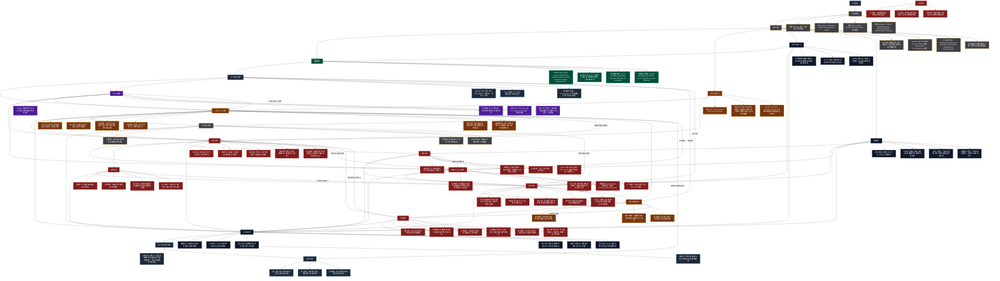

```mermaid
flowchart TD

%% ===== 样式定义 =====
classDef core fill:#1f2937,color:#ffffff,stroke:#60a5fa,stroke-width:2px;
classDef logic fill:#3f3f46,color:#ffffff,stroke:#f59e0b,stroke-width:2px;
classDef data fill:#064e3b,color:#ffffff,stroke:#34d399,stroke-width:2px;
classDef ui fill:#4c1d95,color:#ffffff,stroke:#c084fc,stroke-width:2px;
classDef combat fill:#7f1d1d,color:#ffffff,stroke:#f87171,stroke-width:2px;
classDef economy fill:#78350f,color:#ffffff,stroke:#fbbf24,stroke-width:2px;
classDef ops fill:#0f172a,color:#ffffff,stroke:#94a3b8,stroke-width:2px;

%% ===== 核心主流程 =====
Start[项目启动]:::core
Init[项目初始化]:::logic
Arch[技术架构]:::logic
Data[数据存档]:::data
Lobby[大厅与世界结构]:::core
Base[主城 Tycoon 系统]:::economy
Hero[武将系统]:::combat
Dungeon[副本 Dungeon 系统]:::combat
Battle[战斗系统]:::combat
Reward[奖励与掉落系统]:::economy
Equip[装备系统]:::combat
Mount[战马系统]:::combat
Squad[部曲系统]:::combat
Lord[主公系统]:::combat
Research[科技研发系统]:::logic
UIX[UI UX 系统]:::ui
Economy[经济与商业化]:::economy
Security[防作弊与安全]:::ops
Perf[性能优化]:::ops
Test[测试与验收]:::ops
MVP[MVP 首个可玩版本]:::core
Live[上线与迭代]:::core

Start --> Init
Init --> Arch
Arch --> Data
Data --> Lobby
Lobby --> Base
Base --> Hero
Hero --> Dungeon
Dungeon --> Battle
Battle --> Reward
Reward --> Base
Reward --> Equip
Equip --> Hero
Hero --> Mount
Mount --> Battle
Hero --> Squad
Squad --> Battle
Base --> Research
Research --> Hero
Research --> Base
Lobby --> UIX
UIX --> Base
UIX --> Hero
UIX --> Dungeon
Arch --> Economy
Economy --> Base
Economy --> Hero
Arch --> Security
Security --> Data
Security --> Battle
Arch --> Perf
Perf --> Battle
Perf --> Dungeon
Perf --> Squad
Base --> Test
Hero --> Test
Dungeon --> Test
Battle --> Test
Equip --> Test
Mount --> Test
Squad --> Test
Research --> Test
Security --> Test
Perf --> Test
Test --> MVP
MVP --> Live
Live -->|版本更新/新系统加入| Base
Battle -->|战斗完成| Lobby
Dungeon -->|副本结束| Base
Reward -->|资源反哺| Lobby

%% ===== 项目初始化 =====
Init_D1[创建 Baseplate 项目 / 保存工程 / 命名游戏]:::logic
Init_D2[打开 Explorer / Properties / Output / Asset Manager / Toolbox]:::logic
Init_D3[配置 Game Settings / Avatar R15 / Team Create / 基础权限]:::logic
Init_D4[检查 Workspace / Players / ReplicatedStorage / ServerScriptService / ServerStorage / StarterGui]:::logic
Init --> Init_D1
Init --> Init_D2
Init --> Init_D3
Init --> Init_D4

%% ===== 技术架构 =====
Arch_D1[客户端与服务端分离 / 客户端负责 UI 动画特效 / 服务端负责数值结算]:::logic
Arch_D2[ModuleScript OOP 结构 / Service Controller 模式 / RemoteEvent RemoteFunction 通信]:::logic
Arch_D3[核心服务规划 / DataService PlayerService HeroService BaseService CombatService DungeonService]:::logic
Arch_D4[所有收益相关逻辑服务端计算 / 客户端只发送操作意图]:::logic
Arch --> Arch_D1
Arch --> Arch_D2
Arch --> Arch_D3
Arch --> Arch_D4

%% ===== 数据存档 =====
Data_D1[DefaultProfile / Player Currency Base Heroes Equipment Mounts Squads Research Dungeon Settings Timers]:::data
Data_D2[使用 ProfileService / 玩家加入加载 / 首次创建默认档案 / 玩家离开保存]:::data
Data_D3[实例数据结构 / HeroId Level Star Quality Skills EquipmentSlots MountId SquadData]:::data
Data_D4[装备与战马结构 / EquipId Slot Rarity Level Refine Gems / MountId Level Star SkillLevel]:::data
Data --> Data_D1
Data --> Data_D2
Data --> Data_D3
Data --> Data_D4

%% ===== 大厅与世界结构 =====
Lobby_D1[公共大厅 / 新手出生 / 排行榜 / 活动入口 / 副本入口 / 传送个人主城]:::core
Lobby_D2[个人主城地块 / Plot 分配 / 建筑恢复 / 玩家出生点]:::core
Lobby_D3[副本实例化区域 / ActiveDungeons / 地图模板克隆 / 战斗结束销毁]:::core
Lobby --> Lobby_D1
Lobby --> Lobby_D2
Lobby --> Lobby_D3

%% ===== 主城 Tycoon 系统 =====
Base_D1[Plot 分配 / 玩家进入服务器自动占用空地 / 离开后释放]:::economy
Base_D2[核心建筑 / 主殿 兵营 马场 / 决定上限与功能解锁]:::economy
Base_D3[资源建筑 / 农田 矿场 民居 酒馆 / 按时间产出粮草 铁矿 铜币 招募资源]:::economy
Base_D4[功能建筑 / 兵器冢 演武场 家族大厅 / 解锁玩法入口]:::economy
Base_D5[建筑升级 / 检查主殿等级 / 资源消耗 / 建筑模型替换 / 外观成长]:::economy
Base_D6[懒结算收菜 / 记录上次收取时间 / 计算储量上限 / 点击收取发放资源]:::economy
Base --> Base_D1
Base --> Base_D2
Base --> Base_D3
Base --> Base_D4
Base --> Base_D5
Base --> Base_D6

%% ===== 武将系统 =====
Hero_D1[武将获取 / 酒馆招募 活动奖励 碎片合成 新手赠送]:::combat
Hero_D2[基础养成 / 等级提升 星级突破 技能升级 品质进阶]:::combat
Hero_D3[高级养成 / 羁绊 将星录 天资图谱 天资壁障 耀金血脉]:::combat
Hero_D4[上阵逻辑 / 选择主力武将 / 跟随玩家 / 自动锁敌 / 自动战斗]:::combat
Hero_D5[属性来源 / 基础值 成长率 星级倍率 品质倍率 装备 战马 部曲 科技 Buff]:::combat
Hero --> Hero_D1
Hero --> Hero_D2
Hero --> Hero_D3
Hero --> Hero_D4
Hero --> Hero_D5

%% ===== 装备系统 =====
Equip_D1[装备品质 / 白 绿 蓝 紫 橙 红 / 不同部位不同基础属性]:::combat
Equip_D2[装备获取 / 普通副本 精英副本 兵器冢 每日祭祀 活动兑换]:::combat
Equip_D3[装备强化 / 消耗强化石与铜币 / 最高加20 / 线性成长]:::combat
Equip_D4[装备精炼 / 紫装以上开启 / 百分比属性加成 / 消耗精炼石]:::combat
Equip_D5[套装效果 / 2件 4件 6件激活 / 暴击 免伤 技伤等流派构筑]:::combat
Equip_D6[宝石系统 / 每件4孔 / 不同类型限制 / 12种属性 / 吞噬升级 / 9级淬炼]:::combat
Equip --> Equip_D1
Equip --> Equip_D2
Equip --> Equip_D3
Equip --> Equip_D4
Equip --> Equip_D5
Equip --> Equip_D6

%% ===== 战马系统 =====
Mount_D1[获取方式 / 普通召唤 高级召唤 活动兑换]:::combat
Mount_D2[培养维度 / 等级提升 星级突破 技能解锁]:::combat
Mount_D3[表现方式 / 首版用属性挂件或跟随宠物 / 后续升级为战斗坐骑]:::combat
Mount_D4[核心战马 / 赤兔 的卢 爪黄 绝影 / 输出 抗控 回怒 减伤]:::combat
Mount --> Mount_D1
Mount --> Mount_D2
Mount --> Mount_D3
Mount --> Mount_D4

%% ===== 部曲系统 =====
Squad_D1[招募规则 / 主公等级解锁 / 同一时间绑定1名上阵武将]:::combat
Squad_D2[培养路径 / 训练等级提升 / 每10级进阶 / 军械升阶 / 2到5阶分化兵种]:::combat
Squad_D3[传说兵种 / 无当飞军 突豹骑 元戎弩兵]:::combat
Squad_D4[Roblox 实现 / 每名主将带3到5个小兵 / 跟随与同步攻击 / 低开销 AI]:::combat
Squad --> Squad_D1
Squad --> Squad_D2
Squad --> Squad_D3
Squad --> Squad_D4

%% ===== 主公系统 =====
Lord_D1[主公等级 / 决定建筑等级上限与部分玩法解锁]:::combat
Lord_D2[主公技能 / 聚气类 伤害类 辅助类 / 右下角技能按钮释放]:::combat
Lord_D3[官职系统 / 后期争霸与全属性加成 / 提供更高统帅权]:::combat
Lord --> Lord_D1
Lord --> Lord_D2
Lord --> Lord_D3

%% ===== 科技研发系统 =====
Research_D1[兵营科技 / 提升兵种生命 攻击 技能效率 训练效率]:::logic
Research_D2[建筑科技 / 提升农田 矿场 民居 马场产量与效率]:::logic
Research_D3[节点式研究树 / 前置条件 / 资源消耗 / 分类面板]:::logic
Research --> Research_D1
Research --> Research_D2
Research --> Research_D3

%% ===== 副本系统 =====
Dungeon_D1[副本类型 / 普通推图 精英副本 装备副本 战马副本 部曲材料副本 Boss副本]:::combat
Dungeon_D2[进入流程 / 检查粮草 次数 解锁条件 / 创建实例副本 / 传送玩家与武将]:::combat
Dungeon_D3[地图模板 / ServerStorage 保存模板 / 克隆到 Workspace ActiveDungeons]:::combat
Dungeon_D4[关卡结构 / 出生点 刷怪点 波次 Boss点 结算点]:::combat
Dungeon --> Dungeon_D1
Dungeon --> Dungeon_D2
Dungeon --> Dungeon_D3
Dungeon --> Dungeon_D4

%% ===== 战斗系统 =====
Battle_D1[半自动动作策略 / 玩家可移动 / 武将自动战斗 / 技能手动或自动释放]:::combat
Battle_D2[单位类型 / 玩家 武将 小兵 敌兵 精英 Boss]:::combat
Battle_D3[伤害计算 / 基础属性 技能倍率 暴击 减伤 防御系数 Buff]:::combat
Battle_D4[怒气系统 / 普攻回怒 被击回怒 满怒释放技能]:::combat
Battle_D5[AI 行为 / 锁最近目标 靠近攻击 范围技 远程距离控制 Boss阶段技能]:::combat
Battle --> Battle_D1
Battle --> Battle_D2
Battle --> Battle_D3
Battle --> Battle_D4
Battle --> Battle_D5

%% ===== 奖励与掉落 =====
Reward_D1[副本奖励 / 铜币 经验 装备 材料 武将碎片 募兵令 草料]:::economy
Reward_D2[服务端结算 / 检查胜利条件 / 按掉落表生成奖励 / 写入存档]:::economy
Reward_D3[结算界面 / 展示战斗结果 / 掉落列表 / 返回主城按钮]:::economy
Reward --> Reward_D1
Reward --> Reward_D2
Reward --> Reward_D3

%% ===== UI UX =====
UIX_D1[主 HUD / 血量 怒气 货币栏 主力武将头像 技能按钮 副本目标]:::ui
UIX_D2[系统界面 / 武将 装备 战马 部曲 科技 建筑 抽卡 副本 背包]:::ui
UIX_D3[建筑交互 / BillboardGui 提示 / ProximityPrompt 交互 / 升级与收取]:::ui
UIX_D4[新手引导 / 收菜 升主殿 解锁酒馆 招募武将 升级武将 进入第一关 穿装备]:::ui
UIX --> UIX_D1
UIX --> UIX_D2
UIX --> UIX_D3
UIX --> UIX_D4

%% ===== 经济与商业化 =====
Economy_D1[核心货币 / Coins Food Iron Gems PremiumTickets]:::economy
Economy_D2[资源用途 / 铜币用于招募升级强化 / 粮草用于副本门票 / 铁矿用于建造装备 / 元宝用于高级抽取]:::economy
Economy_D3[商业化 / Developer Products GamePass 月卡 离线收益翻倍 建筑加速 自动收菜]:::economy
Economy --> Economy_D1
Economy --> Economy_D2
Economy --> Economy_D3

%% ===== 防作弊与安全 =====
Security_D1[所有收益逻辑服务端处理 / 抽卡 掉落 资源增加 建筑升级 战斗伤害]:::ops
Security_D2[Remote 校验 / 参数类型 范围 状态 冷却 权限 持有关系]:::ops
Security_D3[客户端只传意图 / 不直接上传结果 / 防止伪造资源与胜利状态]:::ops
Security --> Security_D1
Security --> Security_D2
Security --> Security_D3

%% ===== 性能优化 =====
Perf_D1[控制同屏单位数量 / 玩家 武将 小兵 敌人总量限制]:::ops
Perf_D2[AI 降频 / 距离过远停止更新 / 客户端播放特效 / 服务端只算结算]:::ops
Perf_D3[少用复杂寻路 / 小兵简化逻辑 / 掉落尽量用结算面板代替实体]:::ops
Perf_D4[副本地图小型化 / 流式加载后期接入 / 特效池与对象池优化]:::ops
Perf --> Perf_D1
Perf --> Perf_D2
Perf --> Perf_D3
Perf --> Perf_D4

%% ===== 测试与验收 =====
Test_D1[数据测试 / 首次建档 反复登录 保存异常 断线重连]:::ops
Test_D2[主城测试 / Plot 分配 建筑升级 收菜上限 离线收益]:::ops
Test_D3[武将测试 / 招募概率 碎片转化 升级升星 上阵跟随]:::ops
Test_D4[战斗测试 / 锁敌 技能释放 伤害公式 Boss结算 副本成败]:::ops
Test_D5[装备与扩展测试 / 穿戴 强化 套装 宝石 战马 部曲]:::ops
Test_D6[安全测试 / Remote 滥发 参数异常 重复领奖 数据回滚]:::ops
Test --> Test_D1
Test --> Test_D2
Test --> Test_D3
Test --> Test_D4
Test --> Test_D5
Test --> Test_D6

%% ===== MVP =====
MVP_D1[必做内容 / 存档 Plot 主城 资源建筑 武将招募 武将升级 上阵跟随 一个副本 装备掉落 装备强化]:::core
MVP_D2[暂缓内容 / 羁绊 耀金血脉 将星录 宝石淬炼 官职争霸 国战]:::core
MVP --> MVP_D1
MVP --> MVP_D2

%% ===== 上线与迭代 =====
Live_D1[第二阶段 / 战马 部曲 多武将上阵 科技树 精英副本]:::core
Live_D2[第三阶段 / 羁绊 套装 宝石 精炼 排行榜 活动系统]:::core
Live_D3[第四阶段 / 家族 皇城争霸 跨服 匹配 赛季玩法]:::core
Live --> Live_D1
Live --> Live_D2
Live --> Live_D3

%% ===== 关键回环 =====
Base -->|收集资源后继续养成| Hero
Hero -->|提升战力后挑战副本| Dungeon
Battle -->|胜利获得奖励| Reward
Reward -->|掉落装备与材料| Equip
Equip -->|装备强化后提升武将| Hero
Research -->|科技加成反哺战斗| Battle
Mount -->|坐骑属性增益战斗| Battle
Squad -->|部曲加成反哺副本| Dungeon
UIX -->|引导玩家进入主循环| Base
```