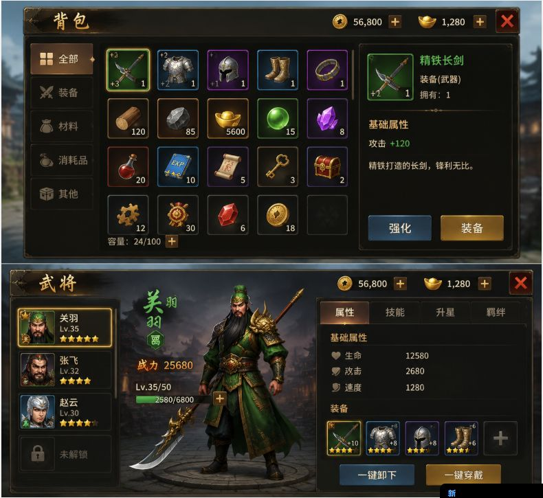

这张参考比上一张更明确：它不是 Roblox 那种“角色旁边挂装备槽”，而是更传统的 **RPG / SLG / 卡牌游戏背包 UI**。你的目标应该变成：

```text
做一套暗色金属质感的 RPG 背包界面
核心：分类列表 + 物品网格 + 物品详情 + 操作按钮
```

我建议你先不要做下面那张“武将界面”，先只做上半部分的**背包页**。结构更清楚，也更适合新手练。

**最终目标**

```text
尺寸：横屏 1560 x 720 或 1920 x 1080
主题：古风 / RPG / 暗色金边 / 高级装备背包
页面：背包主界面
内容：分类、物品格、货币栏、物品详情、强化/装备按钮
工具：Midjourney/SD 生成素材，Figma 组装
```

**界面拆解**

这类背包 UI 可以拆成 7 个模块：

```text
1. 顶部栏：标题“背包”、金币、元宝、关闭按钮
2. 左侧分类：全部、装备、材料、消耗品、其他
3. 中间物品网格：4 行 x 6 列左右
4. 物品格：图标、数量、品质边框、强化等级
5. 右侧详情：物品图、名称、类型、拥有数量、属性、描述
6. 底部容量：24/100 + 扩容按钮
7. 操作按钮：强化、装备
```

你先做这个结构，不要一开始就管所有动画、筛选、排序、拖拽。

**Figma 画布建议**

新建一个 Frame：

```text
Frame: 1560 x 720
背景：模糊游戏场景图，降低亮度
主面板：1480 x 640
面板位置：居中
```

布局比例：

```text
左侧分类栏：180 px
中间物品区：680 px
右侧详情区：460 px
顶部栏：64 px
底部栏：48 px
间距：16-20 px
```

组件尺寸：

```text
分类按钮：150 x 64
物品格：96 x 96
详情物品图：112 x 112
主按钮：160 x 56
关闭按钮：56 x 56
货币框：160 x 40
```

**Figma 组件清单**

你要在 Figma 里做这些组件：

```text
InventoryWindow
TopCurrencyBar
CategoryButton
ItemSlot
ItemIcon
QualityBorder
ItemDetailPanel
StatRow
PrimaryButton
SecondaryButton
CloseButton
CapacityBar
```

最重要的是 `ItemSlot`。它要有这些状态：

```text
empty
normal
selected
locked
new
equipped
```

还要有品质变体：

```text
common：灰色
rare：蓝色
epic：紫色
legendary：金色
green：绿色
```

这一步非常关键，因为背包 UI 本质上就是大量重复格子。你把 `ItemSlot` 做好，后面会轻松很多。

**AI 生成素材，不要生成整张 UI**

不要直接 prompt “帮我生成 RPG 背包界面”。那样出来的字会乱，格子不可控，没法在 Figma 里编辑。

你应该分开生成：

```text
1. 暗色金边主面板
2. 分类按钮背景
3. 物品格背景
4. 品质边框：绿、蓝、紫、金
5. 操作按钮：蓝色强化、金色装备
6. 关闭按钮
7. 图标：金币、元宝、加号、背包、剑、材料、药水、宝箱
8. 物品图：剑、盔甲、头盔、靴子、戒指、木材、矿石、药水、钥匙
```

Midjourney 示例 prompt：

```text
dark fantasy RPG mobile game inventory UI asset sheet, black leather and aged gold trim, ornate Chinese fantasy style, item slots, category buttons, gold borders, blue and gold action buttons, high contrast, clean game UI assets, no text, no letters, no numbers
```

物品图 prompt：

```text
RPG game item icons, ancient Chinese fantasy style, sword, armor, helmet, boots, ring, wood, ore, potion, scroll, key, treasure chest, centered icons, transparent background style, readable at small size, no text, no numbers
```

品质边框 prompt：

```text
square RPG item slot border, ornate gold metal frame, dark inner background, fantasy mobile game UI, isolated asset, transparent background, no text
```

负面词：

```text
text, letters, numbers, watermark, logo, blurry, complex background, cropped, duplicate, messy UI
```

**推荐制作顺序**

你按这个顺序做最稳：

```text
第 1 步：Figma 灰模
只画矩形，把顶部、左栏、中间网格、右侧详情摆好。

第 2 步：确定视觉风格
先找 5-10 张参考图，统一成“暗色 + 金边 + 古风 RPG”。

第 3 步：生成 UI 框架素材
先生成面板、按钮、格子、品质边框。

第 4 步：生成物品图标
剑、盔甲、头盔、靴子、戒指、材料、药水、宝箱。

第 5 步：Photopea/PS 清理
所有素材变成透明 PNG，统一尺寸。

第 6 步：Figma 组件化
先做 ItemSlot，再做 CategoryButton，再做 DetailPanel。

第 7 步：组装完整背包
填入 20 个物品，右侧显示一个选中装备详情。

第 8 步：导出
导出整图预览和单独 UI 素材。
```

**第一版只做这些内容**

不要做太多系统。第一版只做：

```text
分类：全部、装备、材料、消耗品、其他
物品：24 个格子
选中物品：精铁长剑
属性：攻击 +120
描述：精铁打造的长剑，锋利无比。
按钮：强化、装备
容量：24/100
货币：金币 56,800，元宝 1,280
```

这样你的第一版会非常完整，但不会失控。

**你要重点练的不是画图，而是这 4 件事**

```text
1. 信息层级：玩家先看哪里，再看哪里
2. 重复组件：物品格、分类按钮、属性行
3. 状态设计：选中、空格、品质、可点击、不可点击
4. 风格统一：按钮、边框、图标、字体都像同一个游戏
```

我的建议是：**先用 Figma 做一张无 AI 素材的灰模，再用 AI 补美术。**  
如果你一开始就生成漂亮图，很容易被细节带跑；先把结构搭对，后面风格化会顺很多。