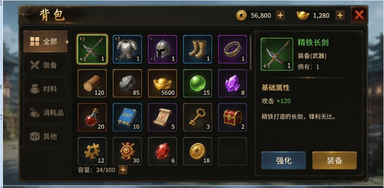

可以。我们先做**精简版 RPG 背包 UI**，先不碰复杂美术，只用 Figma 的矩形、描边、文字、图标把结构搭出来。

先做这一版：

```text
画布：1560 x 720
风格：暗色金边 RPG 背包
模块：顶部栏 / 左侧分类 / 中间物品格 / 右侧详情 / 底部操作
```

**总配色**

你色弱，所以先用一套**高对比、容易区分、不会只靠颜色判断**的颜色。每个状态都要配合文字、图标、描边粗细来区分。

```text
背景遮罩：#101010
主面板：#17130D
主面板描边：#8A6A2F

金色主色：#D6A63A
亮金色：#F2C94C
深金色：#6B4A16

普通文字：#F5EBD0
弱文字：#A99B7A
黑色文字：#1A1308

按钮蓝：#2F6F9F
按钮蓝描边：#79B7E3

危险红：#B83A2E
危险红亮边：#FF6A5E

格子底色：#242018
格子描边：#5D5140
选中描边：#F2C94C

绿色属性加成：#3DBA64
紫色品质：#8A5CF6
蓝色品质：#3A8DDE
灰色品质：#8C8C8C
```

为了避免色弱误判，品质不要只靠颜色。你可以加小标签：

```text
普通：N
稀有：R
史诗：E
传说：L
```

---

**第 1 步：创建画布**

在 Figma 新建 Frame：

```text
名称：Inventory_UI_Simple
尺寸：1560 x 720
背景色：#101010
```

再放一个背景图层：

```text
矩形：1560 x 720
颜色：#101010
透明度：100%
```

如果你有游戏场景截图，可以放在最底层，然后加一层：

```text
遮罩矩形：#000000
透明度：65%
```

没有截图也没关系，先纯黑背景。

---

**第 2 步：主面板**

画一个大面板：

```text
位置：X 35, Y 35
尺寸：1490 x 650
圆角：4
填充：#17130D
描边：#8A6A2F
描边粗细：2
```

加内层描边感：

```text
再画一个矩形
位置：X 45, Y 45
尺寸：1470 x 630
填充：无
描边：#3D3120
描边粗细：1
圆角：3
```

这一步完成后，你应该看到一个暗色金边大窗口。

---

**第 3 步：顶部栏**

顶部栏放标题、货币、关闭按钮。

标题区域：

```text
位置：X 60, Y 45
尺寸：260 x 58
填充：#211A10
描边：#6B4A16
文字：背包
文字颜色：#F2C94C
字号：34
字重：Bold
```

货币区域：

```text
金币框：
X 1010, Y 52
W 180, H 42
填充：#211A10
描边：#6B4A16
文字：金币 56,800
文字颜色：#F5EBD0
字号：20

元宝框：
X 1205, Y 52
W 180, H 42
填充：#211A10
描边：#6B4A16
文字：元宝 1,280
文字颜色：#F5EBD0
字号：20
```

关闭按钮：

```text
X 1440, Y 48
W 58, H 58
填充：#5A1712
描边：#FF6A5E
文字：X
文字颜色：#FFFFFF
字号：36
字重：Bold
```

---

**第 4 步：左侧分类栏**

左侧栏：

```text
X 60, Y 120
W 180, H 500
填充：#120F0A
描边：#4A3A22
```

分类按钮做 5 个：

```text
按钮尺寸：150 x 58
X：75
间距：12
```

按钮内容：

```text
全部
装备
材料
消耗品
其他
```

第一个“全部”是选中状态：

```text
选中按钮填充：#6B4A16
选中描边：#F2C94C
文字颜色：#FFFFFF
左侧小条：#F2C94C，宽 5
```

未选中按钮：

```text
填充：#1B1710
描边：#3D3120
文字颜色：#A99B7A
```

建议加文字前缀，避免只靠颜色：

```text
■ 全部
剑 装备
石 材料
瓶 消耗品
箱 其他
```

---

**第 5 步：中间物品网格**

物品区：

```text
X 265, Y 120
W 660, H 500
填充：#120F0A
描边：#4A3A22
```

做 5 列 x 4 行：

```text
格子尺寸：96 x 96
横向间距：18
纵向间距：18
起始 X：285
起始 Y：140
```

普通物品格：

```text
填充：#242018
描边：#5D5140
描边粗细：2
圆角：3
```

选中物品格：

```text
填充：#242018
描边：#F2C94C
描边粗细：4
圆角：3
```

空格子：

```text
填充：#16130E
描边：#332B1F
描边粗细：1
透明度：70%
```

物品图标先用简单文字占位也可以：

```text
剑
甲
盔
靴
戒
木
石
药
钥
箱
```

数量文字：

```text
位置：格子右下角
颜色：#F5EBD0
字号：18
字重：Bold
加黑色阴影：#000000，Y 1，Blur 2
```

品质小标签放左上角：

```text
N / R / E / L
尺寸：26 x 22
背景：#000000 60%
文字：#FFFFFF
字号：14
```

---

**第 6 步：底部容量**

容量条放在物品区底部：

```text
X 285, Y 600
W 220, H 32
填充：透明
文字：容量：24/100
文字颜色：#F5EBD0
字号：18
```

加号按钮：

```text
X 500, Y 594
W 36, H 36
填充：#6B4A16
描边：#F2C94C
文字：+
文字颜色：#FFFFFF
字号：24
```

---

**第 7 步：右侧详情面板**

详情面板：

```text
X 950, Y 120
W 530, H 500
填充：#120F0A
描边：#4A3A22
```

顶部物品预览：

```text
物品图框：
X 980, Y 150
W 120, H 120
填充：#242018
描边：#F2C94C
描边粗细：3
```

物品名称：

```text
X 1120, Y 150
文字：精铁长剑
颜色：#F2C94C
字号：26
字重：Bold
```

物品类型：

```text
文字：装备（武器）
颜色：#F5EBD0
字号：18
```

拥有数量：

```text
文字：拥有：1
颜色：#A99B7A
字号：18
```

属性标题：

```text
文字：基础属性
颜色：#D6A63A
字号：20
字重：Bold
```

属性内容：

```text
攻击 +120
攻击文字颜色：#F5EBD0
+120 颜色：#3DBA64
字号：20
```

描述：

```text
精铁打造的长剑，锋利无比。
颜色：#CFC2A3
字号：18
行高：28
```

---

**第 8 步：操作按钮**

右下两个按钮：

强化按钮：

```text
X 980, Y 560
W 170, H 58
填充：#2F6F9F
描边：#79B7E3
文字：强化
文字颜色：#FFFFFF
字号：22
字重：Bold
```

装备按钮：

```text
X 1190, Y 560
W 220, H 58
填充：#A5751E
描边：#F2C94C
文字：装备
文字颜色：#FFFFFF
字号：22
字重：Bold
```

主操作按钮用金色，次级操作按钮用蓝色。这样不会混。

---

你现在先做 **第 1 到第 5 步**：画布、主面板、顶部栏、左侧分类、中间物品格。

先不要做右侧详情，也不要找图标。  
第一目标是：**结构清楚，格子对齐，颜色能分辨。**